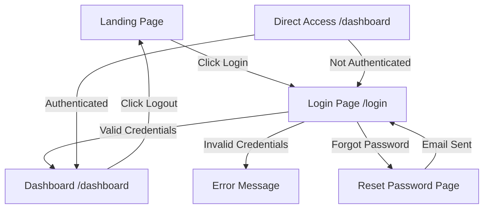

# Product Requirements Document (PRD)
# Controx AI - AI Voice Agent Dashboard

**Version:** 1.0  
**Last Updated:** February 5, 2026  
**Project Status:** In Development

---

## 1. Executive Summary

**Controx AI** is a B2B SaaS platform that provides realistic AI voice agents for business communication. The platform enables businesses to automate customer calls, capture leads, and deliver 24/7 support through human-like AI voice interactions.

**Target Users:** Business clients (B2B) who need AI voice agents for customer communication  
**Platform Type:** Web-based dashboard for managing AI voice agents  
**Business Model:** SaaS with admin-managed user accounts (no public signup)

---

## 2. Product Overview

### 2.1 Core Value Proposition

- **Human-like AI voice agents** that answer calls and engage customers
- **24/7 availability** for customer support and lead capture
- **Seamless integration** with existing business communication systems
- **Real-time analytics** and call monitoring dashboard

### 2.2 Key Differentiators

- Realistic voice quality with natural conversation flow
- Industry-specific agent customization
- Comprehensive call analytics and insights
- Admin-controlled user management (enterprise-grade security)

---

## 3. Tech Stack

### 3.1 Frontend

| Technology | Version | Purpose |
|------------|---------|---------|
| **React** | 19.2.0 | UI framework |
| **Vite** | 7.2.4 | Build tool & dev server |
| **Tailwind CSS** | 4.1.18 | Utility-first styling |
| **Framer Motion** | 12.29.0 | Animations & transitions |
| **React Router** | 7.13.0 | Client-side routing |
| **Recharts** | 3.7.0 | Data visualization |
| **Lucide React** | 0.563.0 | Icon library |
| **Lenis** | 1.3.17 | Smooth scroll |

### 3.2 Backend & Services

| Service | Purpose |
|---------|---------|
| **Supabase** | Authentication, database, real-time subscriptions |
| **Supabase Auth** | User authentication with persistent sessions |

### 3.3 Infrastructure

- **Hosting:** TBD (Vercel/Netlify recommended for frontend)
- **Database:** Supabase (PostgreSQL)
- **Authentication:** Supabase Auth (email/password)
- **Version Control:** Git

---

## 4. Features & Functionality

### 4.1 Public Landing Page ✅ COMPLETE

**Route:** `/`

**Sections:**
- Hero with call-to-action buttons
- Social proof indicators
- Problem statement
- Solution overview
- Industry use cases
- Feature highlights
- Integration showcase
- Security & compliance
- Customer testimonials
- FAQ section
- CTA section
- Footer

**Design:**
- Glassmorphic UI with gradient backgrounds
- Purple/blue/cyan color scheme
- Smooth scroll animations (Lenis)
- Fully responsive (mobile-first)

### 4.2 Authentication System ✅ COMPLETE

**Implementation Date:** February 5, 2026

**Features:**
- ✅ Email/password login (no public signup)
- ✅ Protected dashboard route
- ✅ Persistent sessions (survives browser restart)
- ✅ Password reset via email
- ✅ Auto-redirect logic (unauthenticated → login)
- ✅ Logout functionality
- ✅ Loading states & error handling

**Routes:**
- `/login` - Login page
- `/reset-password` - Password reset page
- `/dashboard` - Protected dashboard (requires auth)

**User Management:**
- Users created by super admin via Supabase dashboard
- No self-registration available
- Enterprise-grade access control

### 4.3 Dashboard (Client View) 🚧 IN PROGRESS

**Route:** `/dashboard` (protected)

**Current Status:** UI complete with dummy data, backend integration pending

**Sections:**

| Section | Status | Description |
|---------|--------|-------------|
| **Sidebar Navigation** | ✅ Complete | Overview, Call Logs, Analytics, Billing, Settings |
| **Stats Grid** | 🟡 Dummy Data | Total calls, active agents, revenue, avg. duration |
| **Analytics Chart** | 🟡 Dummy Data | Line chart showing call/revenue trends |
| **Pie Chart** | 🟡 Dummy Data | Call distribution visualization |
| **Recent Calls Table** | 🟡 Dummy Data | Latest call records with details |
| **Settings Panel** | 🟡 Dummy Data | Currency selection, preferences |
| **Logout** | ✅ Complete | Functional logout with redirect |

**Planned Features:**
- Real-time call data from Supabase
- Currency conversion for international clients
- Call filtering and search
- Export call logs (CSV/PDF)
- Agent performance metrics

### 4.4 Super Admin Dashboard 🚧 IN PROGRESS

**Route:** `/admin` (protected, super admin only)

**Implementation Date:** February 5, 2026

**Design:** Emerald/Teal theme (distinct from client cyan/purple), command center aesthetic

**Sections:**

| Section | Status | Description |
|---------|--------|-------------|
| **Overview** | ✅ Complete | System-wide stats (orgs, agents, calls, revenue) |
| **Organizations** | 🟡 Partial | Table view with search, dummy data |
| **Agents** | 🟡 Placeholder | Link agents to organizations (UI ready) |
| **Analytics** | 🟡 Placeholder | Aggregated system analytics |

**Key Features:**
- ✅ Emerald/teal gradient theme (visually distinct from client dashboard)
- ✅ Sidebar navigation with 4 tabs
- ✅ Role-based routing (super admin only access)
- ✅ Organizations table with status badges
- 🚧 Create organization (UI button ready, modal pending)
- 🚧 Link/unlink agents (placeholder)
- 🚧 System analytics charts (placeholder)

**Planned Features:**
- Auto-create organization + user account
- Send credentials email (Supabase + UI display)
- Edit/delete organizations
- Link Retell agents to orgs
- Real-time org/agent data
- System-wide analytics dashboard


### 5.1 Authentication Flow



### 5.2 Client Dashboard Flow

```
1. User logs in
2. Dashboard loads with:
   - Call statistics
   - Recent activity
   - Agent performance
   - Revenue metrics
3. Navigation options:
   - View call logs
   - Check analytics
   - Review billing
   - Adjust settings
4. Logout returns to landing page
```

---

## 6. Architecture

### 6.1 Frontend Architecture

```
src/
├── components/
│   ├── layout/         # Navbar, Footer
│   ├── sections/       # Landing page sections
│   ├── dashboard/      # Dashboard-specific components
│   ├── ui/             # Reusable UI components
│   └── ProtectedRoute.jsx  # Route guard
├── contexts/
│   └── AuthContext.jsx     # Global auth state
├── lib/
│   └── supabase.js         # Supabase client config
├── pages/
│   ├── LandingPage.jsx     # Public landing
│   ├── Login.jsx           # Login page
│   ├── ResetPassword.jsx   # Password reset
│   └── Dashboard.jsx       # Client dashboard
├── App.jsx                 # Root component + routing
└── main.jsx               # App entry point
```

### 6.2 Data Flow

1. **Authentication:**
   - AuthContext wraps entire app
   - Supabase manages sessions in localStorage
   - ProtectedRoute checks auth state before rendering

2. **Dashboard Data (Future):**
   - Fetch call data from Supabase on mount
   - Real-time subscriptions for live updates
   - Currency conversion on client-side

---

## 7. Security & Privacy

### 7.1 Authentication Security

- ✅ Environment variables gitignored
- ✅ Supabase Row Level Security (RLS) enforced
- ✅ Anon key safe for client-side use
- ✅ Session tokens auto-refresh
- ✅ Secure password reset flow

### 7.2 Data Protection

- All credentials stored in `.env` (not committed to git)
- HTTPS enforced in production
- Client data isolated per user (RLS policies)

---

## 8. Design System

### 8.1 Color Palette

| Color | Hex | Usage |
|-------|-----|-------|
| **Primary Cyan** | `#06B6D4` / `#22D3EE` | CTAs, highlights, accents |
| **Primary Purple** | `#A855F7` / `#C084FC` | Gradients, secondary accents |
| **Primary Blue** | `#0044CE` / `#3B82F6` | Active states, links |
| **Background Dark** | `#000103` | Main background |
| **White/Gray** | `#FFFFFF` / `#9CA3AF` | Text, borders |

### 8.2 Typography

- **Font Family:** Default sans-serif (can be customized)
- **Headings:** Bold, large sizes (5xl-7xl)
- **Body:** Regular, readable (sm-lg)
- **UI Elements:** Medium weight, consistent sizing

### 8.3 Design Principles

- **Glassmorphism:** Frosted glass effects with backdrop blur
- **Gradients:** Smooth color transitions (cyan → purple)
- **Animations:** Framer Motion for smooth, performant transitions
- **Responsive:** Mobile-first approach, works on all devices

---

## 9. API Integration (Future)

### 9.1 Supabase Tables (Planned)

| Table | Purpose |
|-------|---------|
| `users` | User profiles (managed by Supabase Auth) |
| `organizations` | Client company details |
| `agents` | AI voice agent configurations |
| `calls` | Call records and metadata |
| `analytics` | Aggregated analytics data |
| `billing` | Subscription & payment info |

### 9.2 API Endpoints (Planned)

- `GET /calls` - Fetch call history
- `GET /agents` - List active agents
- `GET /analytics` - Dashboard statistics
- `POST /calls/:id/feedback` - Submit call feedback

---

## 10. Roadmap

### Phase 1: Foundation ✅ COMPLETE
- [x] Landing page design & development
- [x] Dashboard UI (dummy data)
- [x] Authentication system (Supabase)
- [x] Protected routes
- [x] Logout functionality
- [x] Role-based routing (super admin vs client)

### Phase 2: Super Admin Dashboard 🚧 IN PROGRESS  
- [x] Admin dashboard layout with emerald/teal theme
- [x] Organizations table view
- [x] Role detection logic (Option A: no org link)
- [ ] Create organization modal with auto-user creation
- [ ] Send credentials email
- [ ] Edit/delete organizations
- [ ] Link agents to organizations
- [ ] System-wide analytics

### Phase 3: Dashboard Integration 📋 PLANNED
- [ ] Connect client dashboard to Supabase backend
- [ ] Real call data display (fetch from Retell API)
- [ ] User profile management
- [ ] Settings persistence
- [ ] Call filtering & search


### Phase 3: Agent Management 📋 PLANNED
- [ ] Create/edit AI agents
- [ ] Agent configuration interface
- [ ] Agent performance tracking
- [ ] Voice model selection

### Phase 4: Analytics & Reporting 📋 PLANNED
- [ ] Advanced analytics dashboard
- [ ] Custom date range filters
- [ ] Export reports (CSV/PDF)
- [ ] Real-time call monitoring

### Phase 5: Billing & Subscriptions 📋 PLANNED
- [ ] Subscription management
- [ ] Payment integration (Stripe)
- [ ] Usage-based billing
- [ ] Invoice generation

### Phase 6: Admin Panel 📋 PLANNED
- [ ] Super admin dashboard
- [ ] User management (CRUD)
- [ ] Organization management
- [ ] System-wide analytics

---

## 11. Success Metrics

### 11.1 Technical KPIs

- **Page Load Time:** < 2 seconds
- **Authentication Success Rate:** > 99%
- **Dashboard Uptime:** > 99.9%
- **Mobile Responsiveness:** 100% functional

### 11.2 Business KPIs (Future)

- User retention rate
- Average session duration
- Call volume per client
- Revenue per user

---

## 12. Known Limitations & Future Improvements

### Current Limitations
- Dashboard displays dummy data (backend integration pending)
- No user profile editing
- No multi-language support
- No mobile app

### Future Improvements
- Real-time call transcription display
- AI agent customization wizard
- Advanced analytics with AI insights
- Mobile app (React Native)
- Multi-tenancy support
- Webhook integrations

---

## 13. Deployment & Environment

### 13.1 Development Environment

- **Dev Server:** Vite (`npm run dev`)
- **Port:** 5173 (default)
- **Hot Reload:** Enabled

### 13.2 Production Deployment (Planned)

- **Build Command:** `npm run build`
- **Output Directory:** `dist/`
- **Recommended Host:** Vercel, Netlify, or Cloudflare Pages
- **Environment Variables:** Set in hosting provider dashboard

### 13.3 Environment Variables

```env
VITE_SUPABASE_URL=<your_supabase_project_url>
VITE_SUPABASE_ANON_KEY=<your_supabase_anon_key>
```

---

## 14. Support & Maintenance

### 14.1 Dependencies

- All dependencies up-to-date as of Feb 2026
- Regular security audits via `npm audit`
- Monthly dependency updates

### 14.2 Browser Support

- ✅ Chrome (latest)
- ✅ Firefox (latest)
- ✅ Safari (latest)
- ✅ Edge (latest)
- ⚠️ IE11 not supported

---

## 15. Changelog Reference

For detailed change history, see [CHANGELOG.md](./CHANGELOG.md)

---

## 16. Contact & Contributors

**Project Owner:** [Your Name]  
**Development Team:** [Team Details]  
**Last Updated By:** AI Assistant (Antigravity)  
**Date:** February 5, 2026
